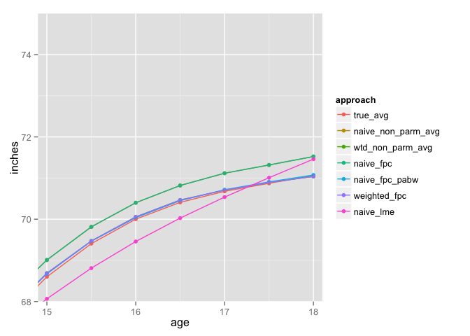
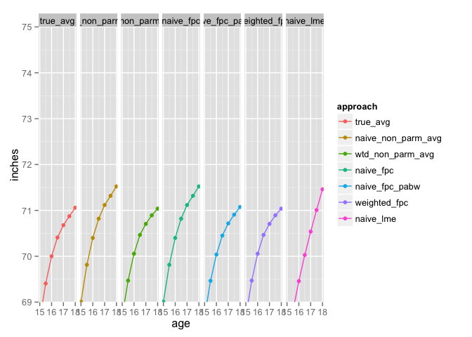

# wfpca:  Weighted Functional Prinicpal Components Analysis
Bruce Swihart  
September 12, 2014  


```r
library(fda)
library(ggplot2)
library(reshape2)
library(refund)
library(nlme)
library(devtools)
install_github("swihart/wfpca")
library(wfpca)
d<-prep_data()
head(d)
over_samp_mat<-sample_data(d,1000)
with_ses <- calculate_ses(over_samp_mat)
long <-make_long(with_ses)
head(long)
censored <- apply_censoring(long)
head(censored,18)
observed_with_stipw <- calculate_stipw(censored,"omit")
wtd_trajectories <- calculate_wtd_trajectories(observed_with_stipw)
head(wtd_trajectories)


## truth, all data:
true_avg <- ddply(long, .(age), function(w)  mean(w$inches))
true_avg$approach<- "true_avg"


## compare the bias of mean trajectories of the following approaches applied to the 
## censored/observed data, not the truth:
##a) naive-nonparametric: that is, just na.rm=TRUE and turn the mean() crank
naive_non_parm_avg <- ddply(observed_with_stipw, .(age), function(w)  mean(w$inches))
naive_non_parm_avg$approach <- "naive_non_parm_avg"
##b) weighted-nonparametric: a little more sophisticated, na.rm=TRUE and turn the weighted mean() crank 
wtd_non_parm_avg <- ddply(observed_with_stipw, .(age), function(w) sum(w$stipw*w$inches)/sum(w$stipw))
wtd_non_parm_avg$approach <- "wtd_non_parm_avg"
##c)  naive-FPC, 
age_vec <- c(sort(unique(long$age)))
unwtd_fncs <- dcast(data=wtd_trajectories, formula= newid~age, value.var="inches")
fpca_unwtd_fncs <- fpca.face(Y=as.matrix(unwtd_fncs[,-1]), argvals=age_vec, knots=29)
naive_fpc <- data.frame(age=age_vec, V1=fpca_unwtd_fncs$mu, approach="naive_fpc")
##d) naive-FPC-post-adjusted-by-weights, and 
pabw <- dcast(data=wtd_trajectories, formula= newid~age, value.var="stipw01.n")
pabw[pabw==0]<-NA
pabw_fpca_unwtd_fncs <- fpca_unwtd_fncs$Yhat*pabw[,-1] ## element-wise
naive_fpc_pabw_avg <- colMeans(pabw_fpca_unwtd_fncs,na.rm=TRUE)
naive_fpc_pabw <- data.frame(age=age_vec, V1=naive_fpc_pabw_avg, approach="naive_fpc_pabw")
##e) weighted-FPC. 
wtd_fncs <- dcast(data=wtd_trajectories, formula= newid~age, value.var="inches_wtd")
fpca_wtd_fncs <- fpca.face(Y=as.matrix(wtd_fncs[,-1]), argvals=age_vec, knots=29)
weighted_fpc <- data.frame(age=age_vec, V1=fpca_wtd_fncs$mu, approach="weighted_fpc")
##f) lme
#library(lme4)
#naive_lme<-lmer(inches ~ ns(age, df=5) + (1+age|newid), data=observed_with_stipw)
#predict(naive_lme, newdata=data.frame(age=age_vec), level=0)
library(nlme)
naive_lme_model<-lme(inches ~ ns(age, df=10), random=~age|newid, data=observed_with_stipw)
predict(naive_lme_model, newdata=data.frame(age=age_vec), level=0)
naive_lme <- data.frame(age=age_vec, V1=predict(naive_lme_model, newdata=data.frame(age=age_vec), level=0), approach="naive_lme")

## plot each approach's mean
means <- rbind(true_avg, naive_non_parm_avg, wtd_non_parm_avg, naive_fpc, naive_fpc_pabw, weighted_fpc, naive_lme)
means$approach<-factor(means$approach, levels=unique(means$approach))
colnames(means)[colnames(means)=="V1"]<- "inches"
library(ggplot2);
ggplot(means, aes(x=age,y=inches, colour=approach))+geom_point()+geom_path()
```

 

```r
## zoom!
ggplot(means, aes(x=age,y=inches, colour=approach))+geom_point()+geom_path()+coord_cartesian(xlim=c(14.9,18.1),ylim=c(68,75))
```

 

```r
## zoom! +facetting reveals overplotting
## naive_non_parm_avg == naive_fpc
##   wtd_non_parm_avg == weighted_fpc
##   naive_fpc_pabw is distinct but in ball park
ggplot(means, aes(x=age,y=inches, colour=approach))+geom_point()+geom_path()+coord_cartesian(xlim=c(14.9,18.1),ylim=c(69,75)) + facet_grid(.~approach) 
```

 

Note:  WE only used the boys from the Berkeley study:


```r
  growth.mlt <- melt(growth[-3])  # don't need 3rd element since it is in rownames
ggplot(growth.mlt, aes(x=Var1, y=value, group=Var2)) +
  geom_line() + facet_wrap(~ L1)
```

 


