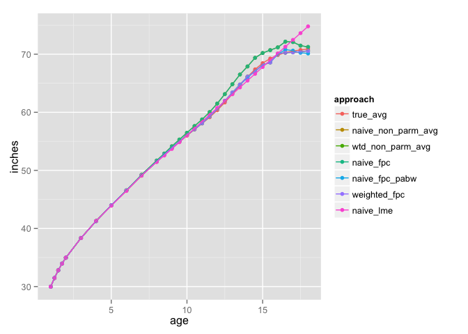

# wfpca:  Weighted Functional Prinicpal Components Analysis
Bruce Swihart  
September 12, 2014  


```r
library(fda)
library(ggplot2)
library(reshape2)
growth.mlt <- melt(growth[-3])  # don't need 3rd element since it is in rownames
ggplot(growth.mlt, aes(x=Var1, y=value, group=Var2)) +
  geom_line() + facet_wrap(~ L1)
```

 


